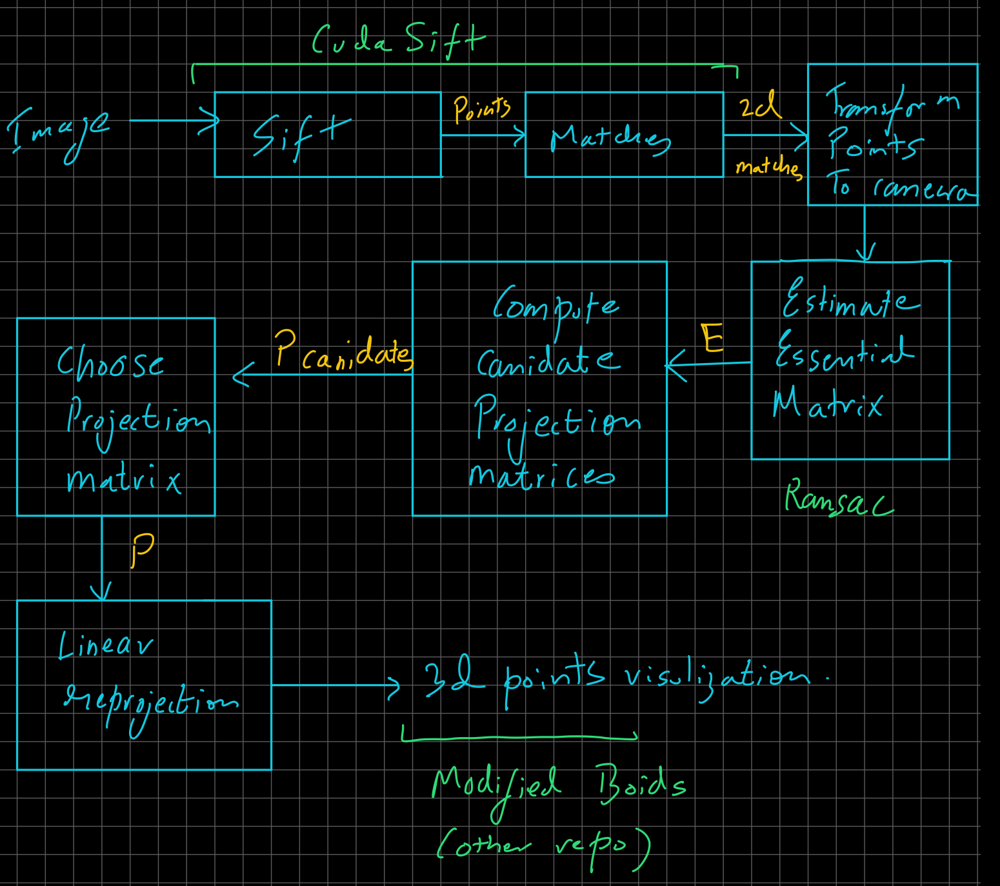
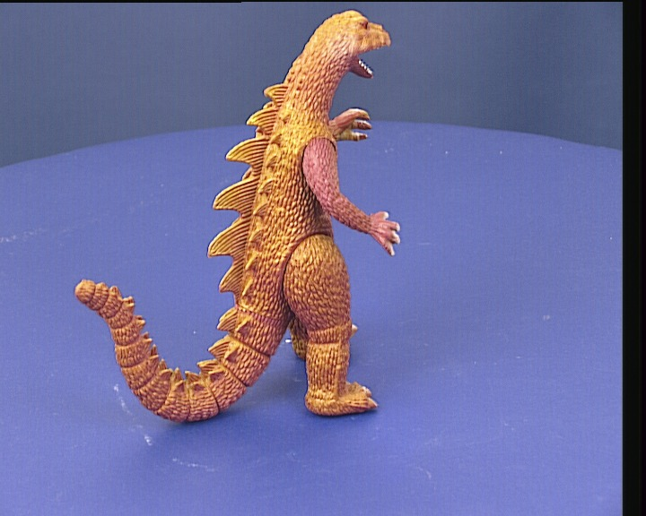
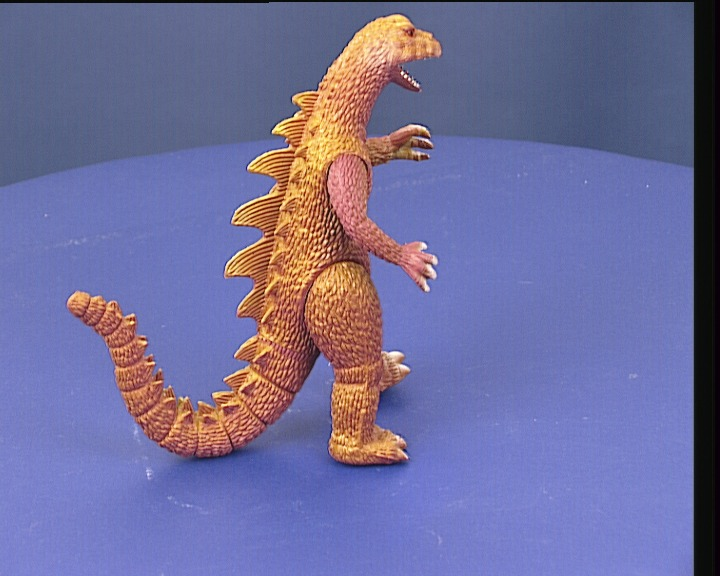
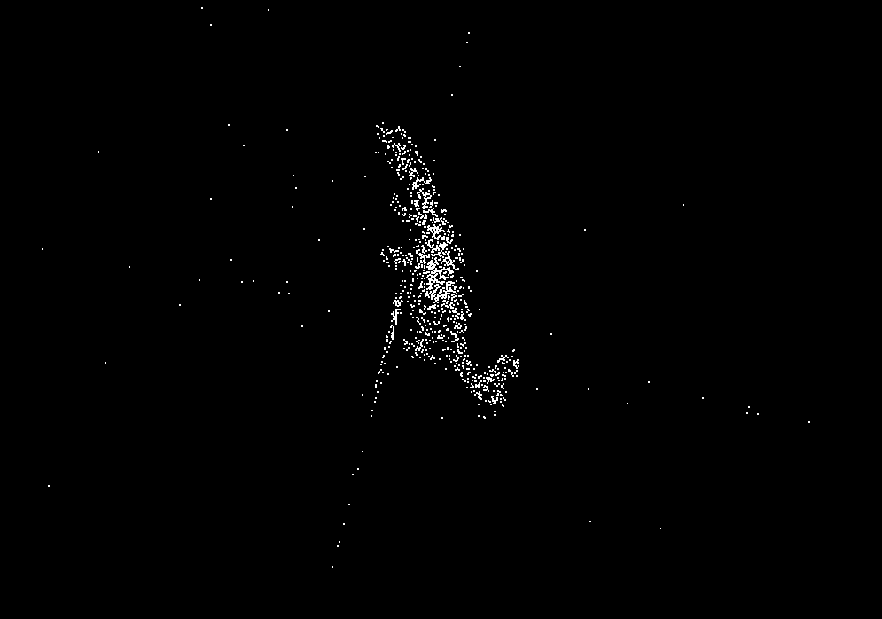
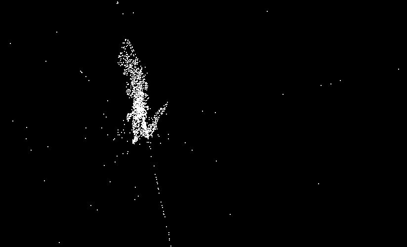
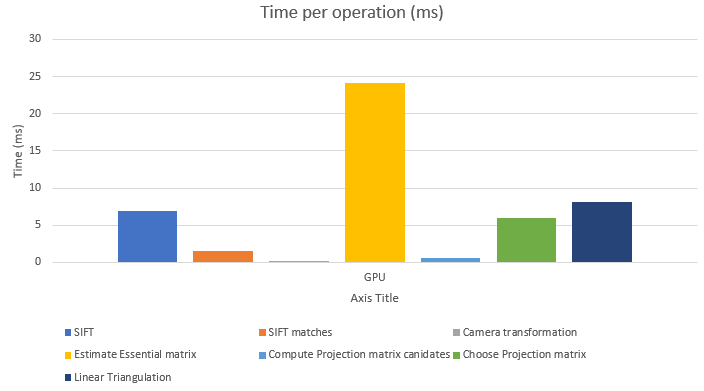
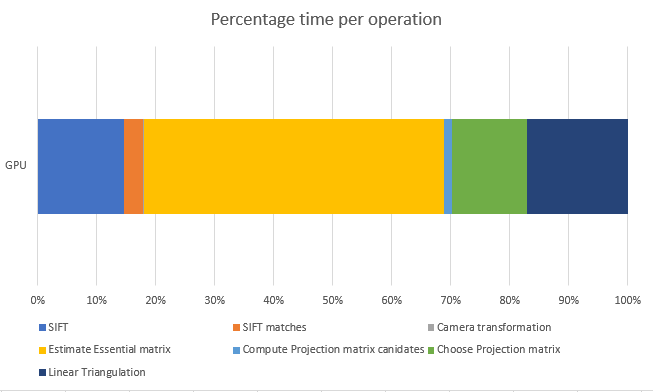

Project 4 SfM on CUDA
====================

**University of Pennsylvania, CIS 565: GPU Programming and Architecture, Project 0**

* Name: Vaibhav Arcot
  *  [LinkedIn](https://www.linkedin.com/in/vaibhav-arcot-129829167/)
* Tested on: Windows 10, i7-7700HQ @ 2.8GHz (3.8 Boost) 32GB, External GTX 1080Ti, 11G (My personal laptop)
* Worked on this project with Dewang Sultania(@Iron-Stark)

### Overview
Structure from motion is the process of extracting a rotation and translation from an pair of images. Using this relative rotation and translation, we can then reproject the pixels into 3d points (without scale) to generate crude 3d meshes. The main contribution of this repo is to have the entire pipeline done on the GPU, making it faster if doing a large number of images. This repo is a learning exercise. Use at your own risk

### Features Implemented (besides vanilla SfM)

* RANSAC for the Essential matrix estimation
* 3D Visualization 

### Dependencies

* Cuda 10+
* cubasl (matrix multiplication)
* cusolve (most Linear algebra)
* opengl (visualization)
* CudaSift (SIFT)
* Thrust (max_element)
* Opencv (to load images)

### Pipeline

* Sift and matches between the images were handled by [CudaSift](https://github.com/Celebrandil/CudaSift), which we had to integrate.
* Transform points to camera used the camera intrinsic matrix to reproject the points
* Estimate essential matrix used RANSAC to filter the candidate essential matrices (using the [8 point algorithm](https://en.wikipedia.org/wiki/Eight-point_algorithm)) to find the matrix that resulted in the maximum number of inliers. This process randomly shuffles the data, so it will result in different candidate matrices each time.
* Next, 4 candidate projection matrices are calculated (because we do not have enough information to get the exact one).
* To choose the correct projection matrix, we can transform a single point and check if it lies in front of both cameras. If it does, we found our projection matrix.
* Finally, we use linear reprojection to convert the points from 2d images into 3d points. This results in the 3d point cloud.
* To perform the visualization, we modified the boid code ([link](https://github.com/Black-Phoenix/Project1-CUDA-Flocking)) to plot a point cloud and have the ability to color them (if we choose to do so in the future).

### Results
To test our algorithm, we decided to run our code on the 3d dinosaur model. The raw images are shown below. Below that are some reconstructions that were created. There is a tradeoff when picking 2 images, we found that if the images are taken from a similar angle, more points were matched but it was harder to see the final 3d model. The flip side is that we don't match as many points so our model ends up looking not as dense as it should. Bundle adjustment would solve this but is way outside the scope of this assignment. The image looks mostly 2d except for the legs which have some depth to them.

The stray points in the image are from the fact that we did not filter the points using a homograph to find outlier matches. This would result in a cleaner appearance.

For time metrics, below is shown the various stages and the time they take on this GPU version. It is clear from below that the majority of the time is spend in the estimate essential matrix, which is performing RANSAC. This can be improved by writing a more efficient SVD computation (or converting the code to a column major standard).

### Thoughts
* We took on way way way too much work. This project turned into a fight against the CUDA API because of its limitations to do linear algebra functions on kernel functions as well as convention issues (row major vs column major).
* The other issue we faced was getting 
* If we had more time, there are a bunch of things that would be easy to do, such as coloring points using the pixel colors, but due to time limitations once we actually got the code up add running, these weren't explored. 

### Future work
* Limit on RANSAC iterations (currently a fixed value)
* Visualization of color
* Bundle adjustment
* Improve SVD performance

### Bloopers
* This project had a ton of issues to complete. No screenshots though because we get the visualization stage done in the last few hours. Many many hours were lost to get a working SVD (semi working but good enough for our use case because we care only about a subset of the components).

### Work division (high level)

| Work                                          | Vaibhav | Dewang |
| --------------------------------------------- | ------- | ------ |
| CudaSift                                      | ✓       | ✓      |
| 3x3 linear algebra (SVD, inverse, matmul)     | ✓       |        |
| Batched linear algebra (SVD, inverse, matmul) |         | ✓      |
| Estimating E Matrix                           | ✓       | ✓      |
| RANSAC                                        | ✓       |        |
| Compute pose candidates                       | ✓       |        |
| Choose correct pose                           | ✓       |        |
| Linear Triangulation                          | ✓       |        |
| Visualization                                 |         | ✓      |

### References

Some important references were

- [Eight point algorithm](http://ece631web.groups.et.byu.net/Lectures/ECEn631%2013%20-%208%20Point%20Algorithm.pdf)
- [Multiple View Geometry in Computer Vision (Hartley & Zisserman)](http://www.robots.ox.ac.uk/~vgg/hzbook/)
- [alyssaq's 3D reconstruction](https://github.com/alyssaq/3Dreconstruction)
- [CudaSift](https://github.com/Celebrandil/CudaSift)
